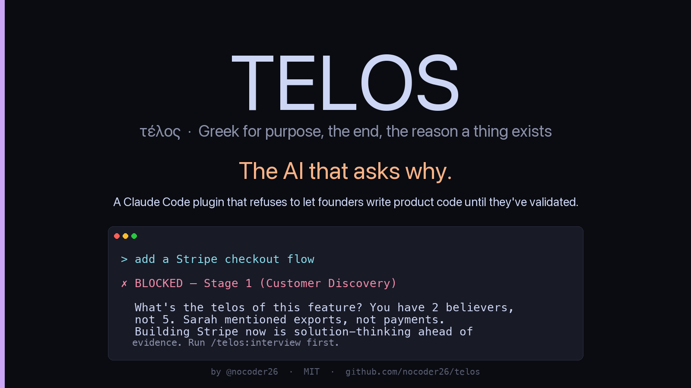
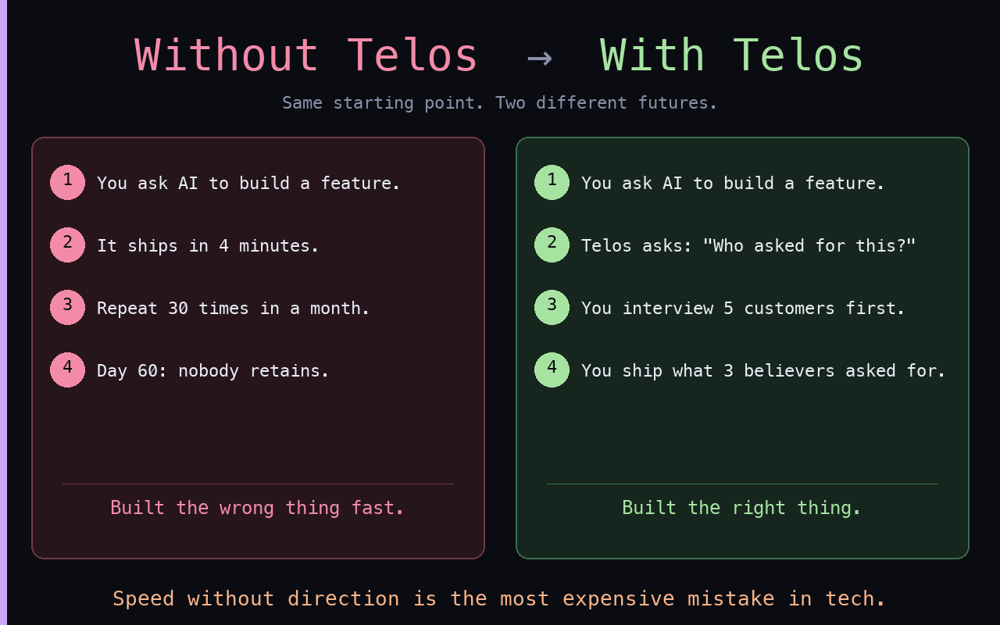
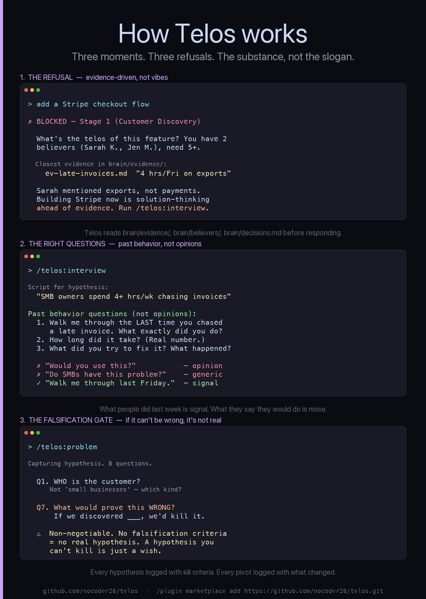

<p align="center">
  
</p>

<p align="center">
  <a href="https://github.com/nocoder26/telos/actions/workflows/tests.yml"></a>
  <a href="https://github.com/nocoder26/telos/blob/main/LICENSE"></a>
  
  
  
  <a href="https://github.com/nocoder26/telos/stargazers"></a>
</p>

# Telos

**The AI that asks why.**

A Claude Code plugin for founders who'd rather validate than ship. Built into the tool you already use to build.

> **What's your telos?** *Telos* is Greek for purpose — the end your work serves. Most AI coding tools say yes to everything. Telos refuses to let you build until you've validated the problem with real customers.

<p align="center">
  
</p>

## Why this exists

I'm building [Izana](https://izana.ai) — an AI fertility wellness companion ([chat.izana](https://github.com/nocoder26/chat.izana), private).

Six months in, I'd shipped 11 AI swarms, a luxury UI, and three pivots. The product looked great. One problem: I'd talked to maybe four real customers in those six months.

Massive scope creep. Solo-founder, AI-coding-tools-go-brrr scope creep.

Claude Code was great at *building*. It just had no opinion about *whether to build*. Every "let me add X" became X, shipped within minutes, untested against any real customer signal.

So I built Telos: a Claude Code plugin that **reads my customer evidence before letting me write product code.** When I try to skip ahead, it pushes back with citations from my own interviews — *"You said the problem was X. This feature serves Y. Reconcile."*

The whole thing comes back to one question: **what's your telos?** What purpose are you serving? Every feature, every line of code should answer that question or get blocked at the gate.

I'm using it on Izana now. The discipline is annoying. It's also why I'm catching wrong-direction features in week 1 instead of week 8.

I'm sharing it because every founder I told asked for the link. If you're using Claude Code (or Cursor, or any AI coding tool) and quietly suspect you're shipping the wrong thing — this is for you.

## Who this is for

- **Founders mid-build** suspecting they're shipping the wrong thing
- **Indie hackers** tired of MRR theater (vanity metrics, no retention)
- **YC / EWOR applicants** who want evidence trails, not narrative gymnastics
- **Anyone using Claude Code** who wants their AI to push back, not just comply

**Not for:**
- Pre-idea explorers (use Notion or whiteboards first)
- Teams that already have PMF (this is too restrictive — graduate to Stage 3+ tools)
- Founders who want validation theater (lean canvas templates without the discipline)

## Why not just use Claude Code?

| | Claude Code | Cursor | **Telos** |
|---|---|---|---|
| Helps you ship code | ✅ | ✅ | ✅ |
| Refuses to ship the *wrong* code | ❌ | ❌ | **✅** |
| Asks *why* before letting you build | ❌ | ❌ | **✅** |
| Tracks customer evidence per feature | ❌ | ❌ | **✅** |
| Forces problem before solution | ❌ | ❌ | **✅** |
| Compounds into a fundraising data room | ❌ | ❌ | **✅** |
| Default-dead detection on hire/spend | ❌ | ❌ | **✅** |

Claude Code is your hands. Telos is the part of you that's seen too many startups die from shipping fast in the wrong direction.

## What it does

**13 skills**, two hooks, and a brain MCP server that ask why before you write product code:

**Front door**
- **`/telos:start`** — concierge walkthrough. Auto-creates `brain/`, runs `/why` → `/problem` → `/interview` in sequence. Real artifact in 10 minutes.

**Anchor & hypothesis**
- **`/telos:why`** — capture and recall your anchor. *"What would make you quit?"* — surfaced when you're tempted to.
- **`/telos:problem`** — problem hypothesis with falsification criteria. No vague answers (the skill pushes back on solution-thinking).

**Customer development**
- **`/telos:interview`** — interview-discipline scripts (focus on past behavior, not opinions). After the call, atomic signals get extracted into your brain.
- **`/telos:roleplay`** — practice the script against a deliberately adversarial AI customer who pushes back, refuses vague claims, and disengages if you argue. Default-pessimistic critique surfaces bad questions before they waste a real call. Pre-flight gates prevent roleplay-as-substitute (refuses if you have zero real interviews, refuses if you've practiced more than you've recruited). Outputs to `brain/practice/` — never counts as evidence.
- **`/telos:believers`** — classify users as Believer / Neutral / Infidel via the earlyvangelist test. Track *believer density*, not vanity user count.

**Build discipline**
- **`/telos:build-check`** — before adding a feature, brain gets queried for matching customer evidence. **No evidence → no build.**
- **`/telos:pivot`** — walks through 10 pivot types using brain evidence. Forces explicit kill criteria for the previous hypothesis.

**Pitch & validation**
- **`/telos:story`** — narrative arc constructor (origin → why-you → journey → vision → ask).
- **`/telos:pitch`** — renders `/story` into a 10-slide deck where **every slide cites brain entries**. Refuses fabricated TAM.
- **`/telos:pmf-check`** — PMF survey (40% disappointed test) + retention cohort + believer density triangulated. Returns Strong PMF / PMF / Pre-PMF / PMF Mirage.

**Survival**
- **`/telos:default-alive`** — runway + growth math. Default alive or default dead, with projection table.

**Optional integrations**
- **`/telos:gbrain`** — bridges your `brain/` into a [gbrain](https://github.com/garrytan/gbrain) MCP instance (by [Garry Tan](https://github.com/garrytan)) so interviews, believers, decisions, and pivots become queryable across projects. Idempotent (re-runs are no-ops via SHA hashing), CONFLICT-detecting (refuses to overwrite gbrain pages edited outside Telos), per-file failure isolation (one bad sync doesn't abort the batch), full audit trail at `brain/integrations/gbrain-log.md`. Hard-refuses if gbrain MCP isn't detected — Telos works perfectly without it.

Plus:
- **PreToolUse hook** — intercepts `Write`/`Edit` calls and asks: *"What evidence supports this?"*
- **SessionStart hook** — opt-in pitch on fresh projects, state-aware orientation on returning sessions
- **Brain MCP server** — exposes 21 tools so skills compose against structured state

## What it refuses to do

- Refuses to celebrate downloads, signups, or MAU without retention.
- Refuses to write a TAM slide unless evidence supports it.
- Refuses to add automation before you've done it manually.
- Refuses to let you skip stages.
- Refuses to let you practice (`/telos:roleplay`) more than you recruit. The discipline is structural, not optional.
- Refuses to fabricate quotes, metrics, or market claims.

**The friction is the feature.**

## The manifesto

I built this because I believe:

- **AI coding tools are quietly making founders worse.** They optimize for shipping speed in a domain where speed is the enemy.
- **Validation isn't a phase. It's a constraint.** Enforced by your tools, not your willpower.
- **Believers > users.** A user who isn't a believer is feedback noise.
- **Building the wrong thing fast is worse than building nothing.** AI made the wrong-thing-fast outcome the default.
- **Default-dead is the most common founder failure mode.** Solvable two months earlier than it gets discovered.
- **Every feature has a telos.** If you can't articulate it, the feature shouldn't exist.

If you disagree with any of these, this tool isn't for you.

## Install

Three slash commands inside Claude Code. Run them **one at a time** — Claude Code concatenates pasted multi-line input.

```
/plugin marketplace add https://github.com/nocoder26/telos.git
```
```
/plugin install telos@telos
```
```
/reload-plugins
```

Then **quit Claude Code (Cmd+Q) and reopen.** Cold start is required for the SessionStart hook to register — `/reload-plugins` doesn't fire it.

That's it. **No Python, no `pip`, no terminal setup required.** Telos works file-only by default.

> Use the full HTTPS URL above — the `nocoder26/telos` shorthand defaults to SSH, which fails unless you have SSH keys configured for GitHub.

### Optional: faster brain queries via Python MCP

Telos ships a Python MCP server that turns the brain into queryable tools. It's a perf optimization, not a requirement — if you skip this, Claude reads `brain/` files directly via Read/Glob and everything still works.

To enable:

```bash
pip install fastmcp
```

(Requires Python 3.10+.)

## Start using it

Open a fresh project directory and start Claude:

```bash
mkdir my-startup && cd my-startup && claude
```

Now type **anything** (e.g., `hi`). The concierge welcome fires automatically:

> *"I'm Telos. I'll spend 10 minutes asking three questions, and you'll walk out with a real customer-interview script and a hypothesis you can kill. Sound good? (yes / I already know what I want / what is this?)"*

Reply:

- **yes** → walks you through `/telos:why` → `/telos:problem` → `/telos:interview` in sequence with one-line context before each step. Auto-creates `brain/`. Exits with a real artifact in 10 minutes.
- **I already know what I want** → drops out, points you to specific skills (`/telos:why`, `/telos:problem`, etc.). Decision logged so you're never re-pitched in this directory.
- **what is this?** → one-paragraph explanation, then re-asks.
- **anything else / change subject** → assumes "no", silenced for this directory forever.

The pitch fires **once per project** (decision logged to `~/.claude/plugins/telos/decided.txt`) and auto-skips directories that look like existing non-startup projects (have `.git`, `package.json`, `Cargo.toml`, etc.). To bootstrap an existing repo, run `/telos:start` manually, or set `TELOS_PITCH_ALWAYS=1`.

If you ever want to trigger the concierge mid-session (or re-trigger after dismissing it), just run:

```
/telos:start
```

## Update / re-install

Plugin format updates aren't automatic. To pick up new versions:

```
/plugin uninstall telos@telos
/plugin marketplace remove telos
/plugin marketplace add https://github.com/nocoder26/telos.git
/plugin install telos@telos
/reload-plugins
```

## Configuration (optional env vars)

```bash
export TELOS_DISABLE_PITCH=1   # never show the opt-in pitch (silent everywhere)
export TELOS_PITCH_ALWAYS=1    # show pitch even in dirs with package.json/.git/etc
```

## Your first 30 minutes

```
$ mkdir my-startup && cd my-startup && claude
> hi

Claude: I'm Telos. I'll spend 10 minutes asking three questions, and
        you'll walk out with a real customer-interview script and a
        hypothesis you can kill. Sound good?
        (yes / I already know what I want / what is this?)

> yes

[brain/ scaffolded automatically. Then runs /telos:why → /telos:problem
 → /telos:interview in sequence, with one-line context before each
 step explaining why it matters.]

[5 questions about your motivation, written to brain/why.md.
 Includes the kill question: "what would make you quit?"]

[8 questions about the pain, who, frequency, founder-market fit,
 falsification criteria, market type. Writes brain/problem.md.
 Stage advances 0 → 1.]

[Generates an interview script tailored to your hypothesis. Past
 behavior questions, not opinions.]

✓ Anchor captured       brain/why.md
✓ Hypothesis captured   brain/problem.md
✓ Interview script      ready

You're at Stage 0 → Stage 1. Send the script to ONE person this week.

> let me build a Stripe integration

🚫 BLOCKED — Stage 1 (Customer Discovery)
   product/ writes are blocked until 5+ believers identified.
   You have 0. Run /telos:interview to find some, then /telos:believers.
```

That's the loop. Talk → log → classify → eventually unlock `product/` → build with evidence citations.

## Skill names — full vs short

All skills are namespaced under `telos:`:

```
/telos:start
/telos:why
/telos:problem
/telos:interview
/telos:roleplay
/telos:believers
/telos:build-check
/telos:pivot
/telos:story
/telos:pitch
/telos:pmf-check
/telos:default-alive
/telos:gbrain          (optional — bridges brain/ into gbrain MCP)
```

**New here?** Run `/telos:start` — it walks you through the first 10 minutes and produces a real interview script before you have to pick any of the others.

The full prefix avoids clashes with other plugins. If you have no other plugin using these names, Claude usually accepts the short form too (e.g., `/why`).

## How it works

Five stages map to validated startup phases:

```
Stage 0  Pre-Discovery       brain only, no code
Stage 1  Customer Discovery  experiments/ allowed, product/ blocked
Stage 2  Validation          product/ allowed but coached against evidence
Stage 3  Growth              less restrictive, decisions still logged
Stage 4  Company Building    out of scope for v1
```

The brain (`brain/`) is just markdown. Git-tracked. You own it. It compounds — by the time you raise, it's your data room.

Three moments that show the substance — the refusal logic, the right interview questions, and the falsification gate that separates real hypotheses from wishes:

<p align="center">
  
</p>

## Methodology

Telos synthesizes well-established startup validation frameworks into one unified discipline:

- **Fall in love with the problem.** Believers vs users. The founder's anchor. The story-led pitch.
- **Get out of the building.** The earlyvangelist test. Customer Development as macro process.
- **Validated learning.** Build-Measure-Learn. The pivot types. PMF survey discipline.
- **Do things that don't scale.** Default alive. Recruit users one by one.

These are public-domain ideas from decades of founder writing, made executable inside the tool you already use to build.

## Roadmap

What's coming. **Watch the repo** to see these land:

- **`/telos:dance`** — VC relationship CRM. Tracks every conversation, suggests follow-ups.
- **`/telos:disrupt-self`** — monthly cannibalization prompt: *"What would a competitor build to kill you? Are you willing to build it first?"*
- **`/telos:crisis`** — assess → act → communicate → learn frame for when things break.
- **`/telos:focus`** — list everything in flight. Force ranking. Below #3 is "kill or defer."
- **`/telos:ceo-checkin`** — weekly: vision / people / cash. Surfaces drift over time.

Got a skill request? [Open an issue](https://github.com/nocoder26/telos/issues/new?template=skill_request.md) — there's a template that gates against generic additions.

## FAQ

**Q: Why "Telos"?**
Greek for *purpose, end, the goal a thing serves*. Every feature should have a telos — if you can't articulate the purpose it serves, the feature shouldn't exist. The plugin asks why before letting you ship.

**Q: Is this real, or theory?**
I'm using it on Izana right now. The whole repo is the receipts of a founder thinking through validation in real time. Privacy note in `.gitignore` — your fork can keep brain content private.

**Q: Do I need the MCP server?**
Yes for the full experience — the brain MCP exposes 21 query tools (`believer_density()`, `query_evidence()`, `brain_status()`) that skills compose against. Skills CAN fall back to direct file reads if the MCP isn't available, but you lose the structured state.

**Q: Will this make me ship slower?**
Yes, on day 1. Faster by week 4 — because you're shipping the right thing instead of pivoting away from the wrong one. (I shipped 11 AI swarms before this; I haven't shipped a wrong feature since.)

**Q: I already have PMF. Useful?**
Probably not. This is built for Stage 0–2 founders. If you're in Growth, the discipline is too restrictive — graduate to whatever your team uses.

**Q: Is it opinionated?**
Aggressively. See [CONTRIBUTING.md](CONTRIBUTING.md) — *"if your contribution makes it more general-purpose or less opinionated, it's probably going in the wrong direction."*

**Q: Why is the brain just markdown?**
Because founders should *own* their evidence trail. Git-trackable. Diffable across pivots. Investors can be granted read access. No SaaS lock-in.

**Q: Will you ship more skills?**
`/telos:dance`, `/telos:disrupt-self`, `/telos:focus`, `/telos:ceo-checkin` are next. Open an issue if you want one earlier.

## The Founder

Built by **Sharad** ([@nocoder26](https://github.com/nocoder26)).

Founder of [Izana](https://izana.ai) — AI fertility wellness companion ([chat.izana](https://github.com/nocoder26/chat.izana), main repo, private).

This is the discipline I built for myself when AI coding tools were helping me ship Izana faster than I could validate. The repo is the receipts of a founder using the methodology in real time — including the times I argued with my own tool and lost.

If Telos saves you a week of building wrong: **⭐ the repo.** That's the share signal. **Watch** to follow new skills landing. PRs and issues welcome — see [CONTRIBUTING.md](CONTRIBUTING.md) for the bar (it's high).

## Acknowledgment

Reading [*Fall in Love with the Problem, Not the Solution*](https://www.fallinlovewiththeproblem.com/) by Uri Levine taught me a lot. Telos is influenced by it. Thank you, Uri.

## License

MIT — fork freely.

---

<p align="center">
  <em>Built while validating <a href="https://izana.ai">Izana</a>. The discipline I needed for myself, shared because others asked.</em>
</p>
